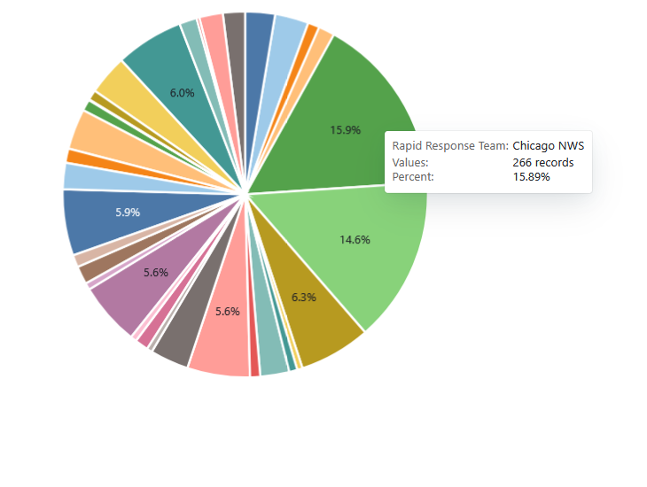
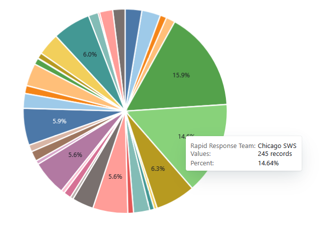

 
```{r, message = FALSE, warning = FALSE, echo = FALSE}

# I. Data Cleaning 
# Load Libraries
library(tidyverse)
library(ggplot2)
library(knitr)
library(here)
library(lubridate)
library(stringr)
library(DT)
library(sf)
library(spdep)

# Load Relevant Data 
data_raw <- read_csv(file = file.path(here(), '10-13-25.csv'),
                        # add appropriate column names
                        col_names = c('location', 'date_time_reported',
                                      'unique_id', 'date_time_raid',
                                      'day', 'time_category', 
                                      'raid_calls', 'notes',
                                      'street_address', 'type_report',
                                      'detention_centers', 'tactics_reported',
                                      'rapid_response_team', 'people_detained',
                                      'verified_by_rrt', 'OCAD_operator_uploaded',
                                      'business_worksite', 'car_description', 'license_plate')) 

# Select all rows, delete columns 20 and 21 (media links)
data_raw <-  data_raw[, c(1:19,23)]
data_raw <-  data_raw %>%
            rename("source" = X23) 

# Format the date and time correctly + make certain columns strings 
data_raw$date_time_reported <-  mdy_hm(data_raw$date_time_reported)
data_raw$date_time_raid <-  mdy_hm(data_raw$date_time_raid)

# Change capitalization and abbreviate to avoid problems downstream
data_raw <- data_raw %>%
  mutate(type_report = str_to_title(type_report)) %>%
  mutate(type_report = str_replace_all(type_report, "Corporate Collaboration", "Corp Collab"),
         type_report = str_replace_all(type_report, "Public Space Raid", "Pub Space Raid"),
         location = str_replace_all(location, "Chicago, |Chicago - |Chicago- ", ""),
         location = str_replace_all(location, ", IL", ""),
         location = case_when(location == "" ~ "Chicago", TRUE ~ location))


# II. Data Transformation 

# Select all false sightings 
data_labeled <- data_raw %>%
  mutate(report_status = case_when(
    # This is the step where the consultant was mixing variables.
    # There is some overlap: some cases proven false were originally tagged as Rumors.
    str_detect(type_report, "False") ~ "Confirmed False",
    # 'False' takes precedence over 'Rumors'.
    str_detect(type_report, "Rumors") ~ "Unconfirmed",
    # Default: treat everything else as Confirmed True.
    TRUE ~ "Confirmed True")) 


# Clean up the labels in the refine_categories to get types of Raids 
data_labeled <- data_labeled %>%
  mutate(refined_categories = str_replace_all(type_report, "False|Rumors", ""),
         refined_categories = str_replace_all(refined_categories, ",,", ","),
         refined_categories = str_replace_all(refined_categories, "^,|,$", ""),
          # Public Space Raid 
         refined_categories = str_replace_all(refined_categories, "Ice Sighting,Pub Space Raid|Pub Space Raid,Ice Sighting",
                                              "Pub Space Raid"),
         # Worksite Raid 
         refined_categories = str_replace_all(refined_categories, "Ice Sighting,Worksite Raid|Worksite Raid,Ice Sighting|Pub Space Raid,Worksite Raid|Worksite Raid,Pub Space Raid", 
                                              "Worksite Raid"),
         refined_categories = case_when(unique_id == "10-09 Chicago - NW-Wrightwood & Drake" ~ "Worksite Raid", TRUE ~ refined_categories),
         # I-9 Audit
         refined_categories = str_replace_all(refined_categories, "Ice Sighting,I-9 Audit", "I-9 Audit"),
         # Corporate Collaboration 
         refined_categories = str_replace_all(refined_categories, "Ice Sighting,Corp Collab", "Corp Collab"),
        # Home raid
        refined_categories = str_replace_all(refined_categories, "Ice Sighting,Home Raid|Home Raid,Ice Sighting", "Home Raid"),
        # Unclassified Raid (for multiple categories)
        refined_categories = case_when(unique_id == "10-06 Orland Park-9815 El Cameno Ln, Orland Park, IL" ~ "Unclass. Raid", TRUE ~ refined_categories),
        refined_categories = case_when(unique_id == "10-09 Evanston/Niles Township-Skokie Hospital, 9600 Gross Point Rd" ~ "Unclass. Raid", TRUE ~ refined_categories),
        # Replace blank spaces with Replace as placeholder
        refined_categories = case_when(is.na(refined_categories)|refined_categories == "" ~ "No tags", TRUE ~ refined_categories))

# III. Manual Edits 

# Clean up certain incidents manually that need additional reclassification
data_labeled <- data_labeled %>%
  mutate(refined_categories = 
           case_when(unique_id == "09-11 Melrose Park-River Forest on Chicago Ave." ~ "Unclass. Raid",
                     # They specifically raided a construction site 
                     unique_id == "09-18 Chicago - NWS - Hermosa-Springfield & North Ave." ~ "Worksite Raid",
    TRUE ~ refined_categories))

# Label specific worksites 
data_labeled <- data_labeled %>%
  mutate(business_worksite = 
           case_when(unique_id == "09-18 Chicago - NWS - Hermosa-Springfield & North Ave." ~ "Construction Site", TRUE ~ business_worksite))

```


**I. Differentiation from AirTable Data**

The dashboard in AirTable counts each of the tags and produces a bar chart. Since this chart considers FALSE and Rumors a classification tag, instead of as a separate variable, it unintentionally overstates the I-9 audits, incidents of corporate collaboration, worksite raids, home raids, public space raids, and ICE sightings that have occurred up to 10.13.

For example, the Airtable Dashboard includes 1,498 ICE sightings, but this count includes sightings that have later been proven False ("Ice Sighting, False"). If we actually break down ICE sightings by whether or not they are true, false, or unproven, we find that 512 were confirmed true, 129 are confirmed false, and 857 were unable to be confirmed.

```{r, message = FALSE, warning = FALSE, echo = FALSE}

# Visualization of Confirmed True, Confirmed False, and Unconfirmed 
data_labeled %>%
  group_by(refined_categories, report_status) %>%
  count() %>%
  pivot_wider(names_from = report_status, values_from = n, values_fill = 0) %>%
  # change the order of categories 
  select(refined_categories, `Unconfirmed`, `Confirmed False`, `Confirmed True`) %>%
  # add percentage column for Confirmed True 
  mutate(percentage_confirmed_false = (`Confirmed False`/(`Confirmed True` + `Confirmed False` + `Unconfirmed`)*100)) %>%
  kable(caption = "Type of Incident by Report Validity (All Reports)")


# Bar Chart of variables  
ggplot(data_labeled, aes(x = refined_categories)) +
   geom_bar(aes(fill = report_status )) + 
   labs(title="Histogram Classifying Types of Incidents (All Reports)", 
       subtitle="Includes data from 2.1.2025 to 10.13.25") +
  theme(axis.text = element_text(size = 7)) 


```

**II. Analysis of Activities Verified by RRT**

When we analyze incidents where a rapid responder was dispatched (1008/2360 incidents), we can see that the overall distribution looks similar to the broader data set. 

```{r, message = FALSE, warning = FALSE, echo = FALSE}

# Visualization of Confirmed True, Confirmed False, and Unconfirmed 
data_type_2 <- data_labeled %>%
  filter(verified_by_rrt == "checked") %>%
  group_by(refined_categories, report_status) %>%
  count() 

# Visualization of activities verified by Rapid Responders
data_labeled %>%
  filter(verified_by_rrt == "checked") %>%
ggplot(aes(x = refined_categories)) +
   geom_bar(aes(fill = report_status)) + 
   labs(title="Histogram Classifying Types of Incidents Verified by Rapid Responders", 
       subtitle="Includes data from 2.1.25 to 10.13.25") +
  theme(axis.text = element_text(size = 7)) 


data_labeled %>% 
  filter(verified_by_rrt == "checked") %>%
  group_by(refined_categories, report_status) %>%
  count() %>%
  pivot_wider(names_from = report_status, values_from = n, values_fill = 0) %>%
# Change the order of categories
  select(refined_categories, `Unconfirmed`, `Confirmed False`, `Confirmed True`) %>%
# Add in a column for percentage
  mutate(percentage_confirmed_false = (`Confirmed False`/(`Confirmed True` + `Confirmed False` + `Unconfirmed`)*100)) %>%
  kable(caption = "Type of Incident by Report Validity (Only Reports Verified by Rapid Responders)")


```

Some notable exceptions exist. For example, false incidents comprise **8.6%** of total ICE sightings, but where a rapid responder was dispatched, incidents were proven false **19.0** of the time (*note that a two proportion z-test confirms this gap is significant, p <.0001).

This discrepancy likely occurs because the Airtable database contains additional confirmed incidents that do not come from the FSN. 

``` {r, message = FALSE, warning = FALSE, echo = FALSE}
# Set up for our statistics test 
false_counts <- c(95, 73)
total_counts <- c(808, 328)

# Run two-proportion z-test
prop.test(false_counts, total_counts, alternative = "less", correct = FALSE)

```


**III. Geographic Distribution of Reports**


```{r, message = FALSE, warning = FALSE, echo = FALSE}
# Preparing the GeoJSON
# I. Read GeoJSON file containing Chicago neighborhoods ...........................................
geojson_file <- "chicago_community_boundaries.json"
chicago_communities <- st_read(geojson_file, quiet = TRUE) %>%
mutate(shape_area = as.numeric(shape_area),
       shape_len = as.numeric(shape_len))

# II. Suburbs ......................................................
# Read full Cook County municipalities
suburbs_sf <- st_read("Municipality.geojson", quiet = TRUE) %>%
  rename(community = AGENCY_DESC)

# capitalize our suburb names! 
suburbs_sf$community <- str_to_upper(suburbs_sf$community)

```


``` {r, message = FALSE, warning = FALSE, echo = FALSE}
# Data Cleaning 
# Integrated cleaning + labeling: do broad cleaning first, then apply Chicago mappings last
location_data <- data_labeled %>%
  # 1) create a normalized community column 
  mutate(
    community = str_to_upper(location), 
    community = str_squish(community)
  ) %>%
  # 2) broad cleaning (remove CHICAGO- prefixes, NW/SW tokens, extra text)
  mutate(
    community = str_replace_all(community, "CHICAGO-", ""),
    community = str_replace_all(community, "CHICAGO - ", ""),
    community = str_replace_all(community, "NW / ", ""),
    community = str_replace_all(community, "SW / ", ""),
    community = str_replace_all(community, "NWS - ", ""),
    community = str_replace_all(community, "SWS -|SWS / ", ""),
    community = str_squish(community)
  ) %>%

  # 3) fix common misspellings / simple membership substitutions
  mutate(
    community = case_when(
      community == "KENWOOD/HYDE PARK" ~ "KENWOOD",
      community == "60607" ~ "NEAR WEST SIDE",
      community %in% c("BELMONT CRAIGIN", "BELMONT CRAIGAN", "BELMONT/CRAGIN", "BELMONT-CRAGIN", "BELMONT CRAIGN") ~ "BELMONT CRAGIN",
      community %in% c("BOILINGBROOK", "BOLLINGBROOK") ~ "BOLINGBROOK",
      community == "ANDERSONVILLE" ~ "EDGEWATER",
      community == "ARCHER LIMITS" ~ "GARFIELD RIDGE",
      community == "BARLETT" ~ "BARTLETT",
      community == "CANARYVILLE" ~ "NEW CITY",
      community == "EASTSIDE" ~ "EAST SIDE",
      community == "ELK GROVE" ~ "ELK GROVE VILLAGE", 
      community == "GRESHAM" ~ "AUBURN GRESHAM",
      community == "SCOTTSDALE" ~ "ASHBURN",
      community %in% c("WRIGLEYVILLE", "WRIGLEY", "WRIGLEY FIELD", "SOUTHPORT") ~ "LAKE VIEW",
      community %in% c("GALEWOOD", "SOUTH AUSTIN") ~ "AUSTIN",
      community %in% c("PULASKI PARK", "UKRAINIAN VILLAGE", "UKRANIAN VILLAGE", "EAST UKRAINIAN VILLAGE") ~ "WEST TOWN",
      community %in% c("FULTON MARKET", "WEST LOOP", "TRI TAYLOR", "TRI-TAYLOR", "LITTLE ITALY", "UNIVERSITY VILLAGE", "UNITED CENTER", "MEDICAL DISTRICT", "UIC") ~ "NEAR WEST SIDE",
      community %in% c("PETERSON PARK", "MAYFAIR") ~ "NORTH PARK",
      community == "DOUGLASS PARK" ~ "NORTH LAWNDALE",
      community == "CHRYSLER VILLAGE" ~ "CLEARING",
      community == "KELVYN PARK" ~ "HERMOSA",
      community == "LITTLE VILLAS" ~ "SOUTH LAWNDALE",
      community %in% c("CALUMUT HEIGHTS", "CALUMET") ~ "CALUMET HEIGHTS",
      community == "CHCIAGO- ENGLEWOOD" ~ "ENGLEWOOD",
      community == "SCHAUMBERG" ~ "SCHAUMBURG",
      community == "STREETERVILLE" ~ "NEAR NORTH",
      community %in% c("UNCLEAR", "UNKNOWN", "UNKNOWN", "UNSURE") ~ "UNCLEAR BASED ON CALL",
      community == "WEST ELSTON" ~ "WEST ELSDON",
      community %in% c("REVENSWOOD", "RAVENSWOOD") ~ "LINCOLN SQUARE",
      community == "LINCOLN PARK (WEST)" ~ "LINCOLN PARK",
      community == "CHICAGO" ~ "UNSPEC CHI",
      TRUE ~ community
    )
  ) %>%

  # 4) Now apply the (Chicago) community-area rules and unique_id relabels last
  mutate(
    community = case_when(
      str_detect(community, "PILSEN|LOWER WEST SIDE/HEART OF CHICAGO") ~ "LOWER WEST SIDE",
      str_detect(community, "LITTLE VILLAGE|LA VILLITA|MARSHALL SQUARE/HEART OF CHICAGO|MARSHALL SQUARE") ~ "SOUTH LAWNDALE",
      str_detect(community, "BACK OF THE YARDS|BOTY") ~ "NEW CITY",
      str_detect(community, "DOWNTOWN|THE LOOP") ~ "LOOP",
      str_detect(community, "SOUTH LOOP") ~ "NEAR SOUTH SIDE",
      str_detect(community, "CHICAGO-PORTAGE PARK|PORTAGE PARK") ~ "PORTAGE PARK",
      str_detect(community, "CHICAGO UPTOWN|UPTOWN") ~ "UPTOWN",
      str_detect(community, "CHICAGO ALBANY PARK|ALBANY PARK") ~ "ALBANY PARK",
      str_detect(community, "HUMBOLT PARK|HUMBOLDT PARK") ~ "HUMBOLDT PARK",
      str_detect(community, "WEST LOOP|WICKER PARK|FULTON MARKET DISTRICT") ~ "NEAR WEST SIDE",
      str_detect(community, "WEST 54TH AND PULASKI") ~ "WEST ELSDON",
      str_detect(community, "BUCKTOWN") ~ "WEST TOWN",
      str_detect(community, "MIDWAY") ~ "GARFIELD RIDGE",
      str_detect(community, "CHINATOWN") ~ "ARMOUR SQUARE",
      str_detect(community, "BELMONT/CAGRIN|BELMONT CRAGIN") ~ "BELMONT CRAGIN",
      str_detect(community, "CALUMET PARK") ~ "WEST PULLMAN",
      str_detect(community, "BLUE ISLAND") ~ "MORGAN PARK",
      str_detect(community, "NORTH PULASKI|IRVING PARK|IRVING PARLK") ~ "IRVING PARK",
      str_detect(community, "ROSCOE VILLAGE") ~ "NORTH CENTER",
      str_detect(community, "LAKEVIEW|LAKE VIEW") ~ "LAKE VIEW",
      str_detect(community, "BERWYN CICERO|BERWYN") ~ "CITY OF BERYWYN",
      str_detect(community, "BRIGTON PARK|BRIGHTON PARK") ~ "BRIGHTON PARK",
      str_detect(community, "ILLINOIS MEDICAL DISTRICT") ~ "NEAR WEST SIDE",
      str_detect(community, "ROGER.?S PARK|RP|ROGERS PARK") ~ "ROGERS PARK",
      str_detect(community, "GOLD COAST|NAVY PIER|RIVER NORTH|MAGNIFICENT MILE") ~ "NEAR NORTH SIDE",
      str_detect(community, "GARFILED RIDGE|GARFIELD RIDGE") ~ "GARFIELD RIDGE",
      # Change suburbs to conform with naming conventions 
      str_detect(community, "ELGIN") ~ "CITY OF ELGIN",
      str_detect(community, "EVANSTON") ~ "CITY OF EVANSTON",
      str_detect(community, "DIXMOOR") ~ "VILLAGE OF DIXMOOR",
      str_detect(community, "HIGHLAND PARK") ~ "VILLAGE OF HIGHLAND PARK",
      str_detect(community, "EVERGREEN PARK") ~ "VILLAGE OF EVERGREEN PARK",
      str_detect(community, "CHICAGO RIDGE") ~ "VILLAGE OF CHICAGO RIDGE",
      str_detect(community, "ELMWOOD PARK") ~ "VILLAGE OF ELMWOOD PARK",
      str_detect(community, "HICKORY HILLS") ~ "CITY OF HICKORY HILLS",
      str_detect(community, "CITY OF CICERO") ~ "CITY OF CICERO",
      str_detect(community, "SKOKIE") ~ "VILLAGE OF SKOKIE",
      str_detect(community, "NILES") ~ "VILLAGE OF NILES",
      str_detect(community, "WILMETTE") ~ "VILLAGE OF WILMETTE",
      str_detect(community, "LINCOLNWOOD") ~ "VILLAGE OF LINCOLNWOOD",
      str_detect(community, "NORTHBROOK") ~"VILLAGE OF NORTHBROOK",
      
      

      # relabel southwest / SWS specific unique_id rows (these should override previous values)
      unique_id == "09-25 Hermosa/Humboldt Park-4770 W Grand Ave, Chicago, IL 60639" ~ "HERMOSA",
      unique_id == "02-24 Chicago - SWS-South Shields and West 43rd PL." ~ "FULLER PARK",
      unique_id == "02-26 Chicago - SWS-51st and St. Louis" ~ "GAGE PARK",
      unique_id == "03-07 Chicago - SWS-51st and Spaulding" ~ "GAGE PARK",
      unique_id == "03-14 Chicago - SWS-1352 32nd St." ~ "GAGE PARK",
      unique_id == "04-16 Chicago - SWS-47th and Sacramento" ~ "BRIGHTON PARK",
      unique_id == "04-27 Chicago - SWS -65th and Long" ~ "CLEARING",
      unique_id == "09-25 Chicago - SWS-W 63rd St & S California Ave" ~ "NEW CITY",
      unique_id == "05-14 Chicago - SWS-65th and Harlem" ~ "GARFIELD RIDGE",
      unique_id == "06-16 Chicago - SWS-53rd and Pulaski" ~ "ARCHER HEIGHTS",
      unique_id == "09-18 Chicago - SWS-42nd & Ashland" ~ "NEW CITY",
      unique_id == "02-17 Chicago - NWS-7435 W Talcott Ave, Chicago, IL 60631" ~ "NORWOOD PARK",
      unique_id == "10-09 Chicago - NW-Armitage & Kilbourn" ~ "HERMOSA",
      unique_id == "10-09 Chicago - NW-Cicero & Armitage" ~ "BELMONT CRAIGIN",

      # default: keep whatever is already in community after prior cleaning
      TRUE ~ community
    )
  ) %>%

  # final whitespace squeeze (defensive)
  mutate(community = str_squish(community))

                   
```

Airtable data would suggest that reports are concentrated along the Northwest Side, followed by the Southwest side. However, this assessment is a very broad one and aggregates data from multiple neighborhood teams. 

```{r, message = FALSE, warning = FALSE, echo = FALSE, out.width= "50%"}

```
```{r, message = FALSE, warning = FALSE, echo = FALSE, out.width= "50%"}

```


When we actually look neighborhood by neighborhood, reports are actually concentrated along the west side, followed by the southwest side. 


```{r, message = FALSE, warning = FALSE, echo = FALSE}
# map all reports
all_reports_count <- location_data %>% 
group_by(community) %>%
count() 


# join the counts with evanston data
map_df <- left_join(chicago_communities, all_reports_count, by = "community")

# VI. Map my data ...................................................................
ggplot(map_df) +
  geom_sf(aes(fill = n), color = "black", size = 0.2) +
scale_fill_gradient(low = "green", high = "red", name = "Number of Reports") +
  labs(title = "Figure 1: Reports by Chicago Neighborhood (All)") +
  theme_minimal() +
  theme(legend.position = "right")

```

Confirmed reports are clustered in the following neighborhoods:

```{r, message = FALSE, warning = FALSE, echo = FALSE}

confirmed_reports_count <- location_data %>% 
group_by(community, report_status) %>%
filter(report_status == "Confirmed True") %>%
count() 

# join the counts with evanston data
map_df <- left_join(chicago_communities, confirmed_reports_count, by = "community")

# VI. Map my data ...................................................................
ggplot(map_df) +
  geom_sf(aes(fill = n), color = "black", size = 0.2) +
scale_fill_gradient(
  low = "green", high = "red", name = "Number of Confirmed Reports") +
  labs(title = "Figure 2: Confirmed Reports by Chicago Neighborhood") +
  theme_minimal() +
  theme(legend.position = "right")
```

False reports are clustered in the following neighborhoods:

```{r, message = FALSE, warning = FALSE, echo = FALSE}

false_reports_count <- location_data %>% 
group_by(community, report_status) %>%
filter(report_status == "Confirmed False") %>%
count() 
  
# join the counts with evanston data
map_df <- left_join(chicago_communities, false_reports_count, by = "community")


# VI. Map my data ...................................................................

ggplot(map_df) +
  geom_sf(aes(fill = n), color = "black", size = 0.2) +
scale_fill_gradient(
  low = "green", high = "red", name = "Number of False Reports") +
  labs(title = "Figure 3: False Reports by Chicago Neighborhood") +
  theme_minimal() +
  theme(legend.position = "right")

```

```{r, message = FALSE, warning = FALSE, echo = FALSE}

# join the counts with data from the suburbs
map_df <- left_join(suburbs_sf, all_reports_count, by = "community") 

# VI. Map my data ...................................................................
# ggplot(map_df) +
  # geom_sf(aes(fill = n), color = "black", size = 0.2) +
# scale_fill_gradient(low = "green", high = "red", name = "Number of Reports") +
 # labs(title = "Figure 1: Reports by Chicago Neighborhood (All)") +
  #theme_minimal() +
  # theme(legend.position = "right")

```


**IV. Interpretation and Recommendations**

1.  ICE Sightings are by far the common type of the incident. Thus far, the network has recorded 512 confirmed ICE Sightings, 241 Public Space Raids, 60 Home Raids, 37 work site raids, and 3 I-9 raids.

2.  Nearly 1 in 5 Ice Sightings were proven false by a rapid responder (19.0%). In contrast, only 1.7% percent of public space raids were proven false and 3.8% of home raids were proven false by a responder. 21% percent of ICE sightings were also unable to be verified by a responder. 

    This means **40%** of the time a rapid responder is dispatched, they will either find nothing or find that the sighting is false. 

    Considering this large discrepancy in verifying ICE Sightings, I would recommend the FSN implement a triage system. Would recommend the FSN prioritize potential raids over sightings, since these are far more likely to be confirmed true. Would also suggest the FSN dispatcher query the license plate database and search for a potential match before calling a responder. 

    Would also ask the rapid response leads to discuss the following questions: Is every sighting worth validating, especially in times when we are hurting for volunteer capacity? Is there a threshold that needs to be met for passing along a sighting? 
    
**V. Appendix of Sightings per Neighborhood **
Top 15 Neighborhoods with Reports of ICE Activity: 
```{r, message = FALSE, warning = FALSE, echo = FALSE}
# Top 15 Neighborhoods with Reports of ICE Activity (Regardless of Validity)
all_reports_count %>%
  arrange(desc(n)) %>%
  head(15) %>%
  # Change the name of certain neighborhoods for legibility
  mutate(community = case_when(
                     community == "SOUTH LAWNDALE" ~ "LITTLE VILLAGE",
                     community == "NEW CITY" ~ "BACK OF THE YARDS",
                     community == "LOWER WEST SIDE" ~ "PILSEN",
                   TRUE ~ community)) %>%
  kable()
```

Top 15 Neighborhoods with Confirmed True ICE Activity 
```{r, message = FALSE, warning = FALSE, echo = FALSE}
confirmed_reports_count %>%
  arrange(desc(n)) %>%
  head(15) %>%
   mutate(community = case_when(
                     community == "SOUTH LAWNDALE" ~ "LITTLE VILLAGE",
                     community == "NEW CITY" ~ "BACK OF THE YARDS",
                     community == "LOWER WEST SIDE" ~ "PILSEN",
                   TRUE ~ community)) %>%
  kable()
```

Top 15 Neighborhoods with Confirmed False ICE Activity 
```{r, message = FALSE, warning = FALSE, echo = FALSE}
false_reports_count %>%
  arrange(desc(n)) %>%
  head(15) %>%
   mutate(community = case_when(
                     community == "SOUTH LAWNDALE" ~ "LITTLE VILLAGE",
                     community == "NEW CITY" ~ "BACK OF THE YARDS",
                     community == "LOWER WEST SIDE" ~ "PILSEN",
                   TRUE ~ community)) %>%
  kable()
```

